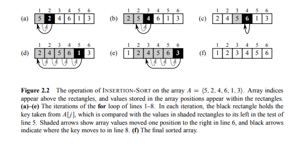

# Exercise 2.1-1

Using Figure 2.2 as a model, illustrate the operation of INSERTION-SORT on the array A = {31,41,59,26,41,58}.

**About Figure 2.2:**


# Answer

## Initial array
#### (Before sorting begins)
    [31 41 59 26 41 58]

## j = 2, key = 41
Compare key with left side(`31`)

    31 [41] 59 26 41 58

41 &ge; 31 &rarr; no shifts.

Array unchanged.

## j = 3, key = 59
Compare with 41 &rarr; OK.

    31 41 [59] 26 41 58
No changes.

## j = 4, key = 26
Compare with 59, 41, 31 &rarr; shifts occur.

```sql
31 41 59 [26]

Shift: 59 -> right
31 41 59 59

Shift: 41 -> right
31 41 41 59

Shift: 31 -> right
31 31 41 59

Insert key:
26 31 41 59
```
Array becomes:

**[26 31 41 59 41 58]**

## j = 5, key = 41
Compare with 59 &rarr; shift

Compare with 41 &rarr; stop (key &ge; 41).

```sql
26 31 41 59 [41]

Shift: 59 -> right
26 31 41 59 59

Insert key into position 4:
26 31 41 41 59
```
Array becomes:

**[26 31 41 41 59 58]**

## j = 6, key = 58
Compare with 59 &rarr; shift

Compare with 41 &rarr; stop.
```sql
26 31 41 41 59 [58]

Shift: 59 -> right
26 31 41 41 59 59

Insert key into position 5:
26 31 41 41 58 59
```

## Final sorted array
**[26 31 41 41 58 59]**
