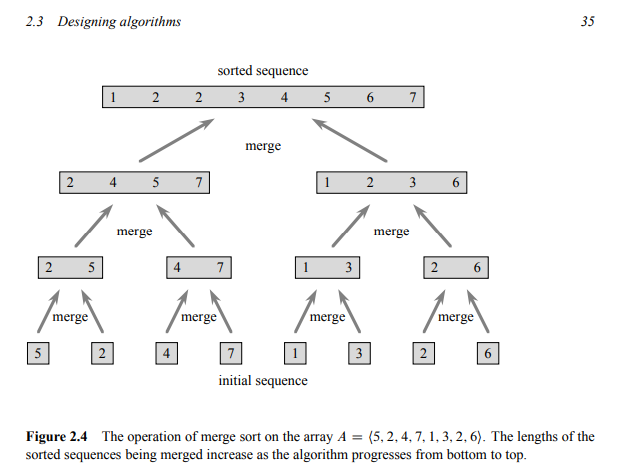
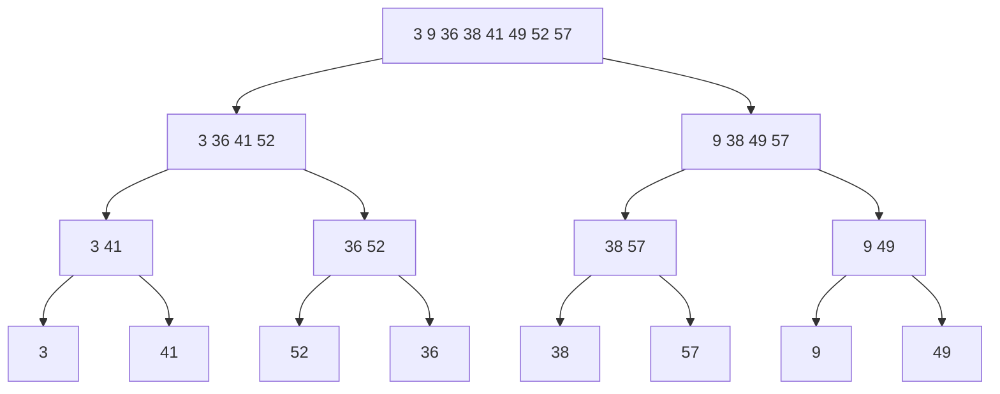

# Exercise 2.3-1

Using Figure 2.4 as a model, illustrate the operation of merge sort on the array $A$ = {3,41,52,36,38,57,9,49}.

### Figure 2.4:

# Answer

By using divide and conquer, I divided the unsorted array into smaller array until its length equal to 1.

Then I sorted them while merging them into an $n + 1$ array.

After that I recursive that step again and again until it length equal to its length at the beginning.

### Here are visualize about it:

